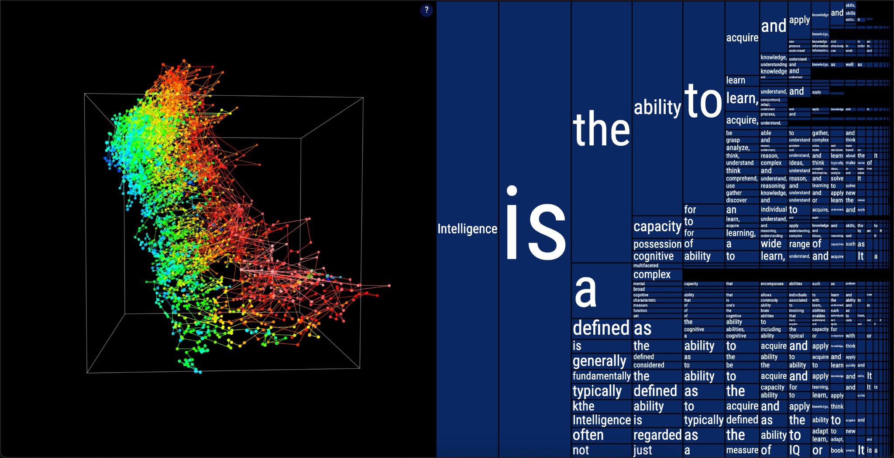

# AI Basics and Policy Statements - Workshop Outline

## Workshop Information

**Title:** AI Basics and Policy Statements  
**Date:** Tuesday, October 1, 2025  
**Duration:** 90 minutes  
**Format:** Interactive workshop with visualizations and policy drafting  
**Facilitator:** Zach Muhlbauer

**Materials:** [AI Basics and Policy Statements [2025 Oct 1]](https://docs.google.com/presentation/d/19AHGsl4uDr1c3-cnUStxyZ0DrZTXyGMd7MkzYdEiV68/edit?usp=sharing) | [https://short-url.org/aipolicy](https://short-url.org/aipolicy)

## Workshop Description

This workshop provides a brief introduction to generative artificial intelligence and helps instructors craft thoughtful and responsive policies for their classes. Together, we will work to demystify AI basics through interactive visualizations and hands-on tinkering, followed by discussion of sample policy statements and their implications across disciplines. Participants will draft syllabus language that represents their values as teachers and offers clear guidance on attribution, use cases, and a working definition of critical AI literacy.

### Learning Objectives

-   Understand AI capabilities and limitations through interactive exploration

-   Analyze the human cost of detection-based policies using student testimonials

-   Create clear, supportive AI policies with attribution guidelines

## **Agenda**

**Part I: Demystifying AI (40 min)**

-   Completion game and neural network visualization

-   AI technology overview

-   How LLMs work

**Part II: Crafting Policies (50 min)**

-   Student testimonials and detection problems

-   Policy components and values

-   Draft your syllabus statement

## **Part I: Demystifying AI Basics (40 min)**

### Opening: Completion Game & Free Write NB: Stipulate definition of Large Language Model (LLM) in reference to examples such as ChatGPT, Claude, or Gemini.

Drawing on the first thing to come to mind, complete the following sentences:

-   I ran to...

-   Please pass...

-   I slept through...

-   Never have I ever...

-   Intelligence is...

[Gemini 2.0 Flash \-- Completion Game.pdf](https://drive.google.com/file/d/1Em7iJfZ7aoIF1un33vXIFrhCFJSEwvCv/view?usp=drive_link)

Post your completions in the chat along with a response to this prompt: What brings you to this workshop, and what do you hope to gain from our time together?

### Neural network visualization

Interactive tool: <https://moebio.com/mind/>

Now we are going to turn our attention to an interactive visualization of how tools like LLMs generate completions based on an initial input from the user.

{width="4.713542213473316in" height="2.4172003499562553in"}

### A brief account of artificial intelligence

Artificial intelligence encompasses many technologies, not just chatbots

-   **Predictive AI** attempts to infer events based historical data (e.g. credit worthiness)

-   **Computer vision** recognizes images and patterns (e.g. facial recognition)

-   **Classification systems** sort and categorize data (e.g. content moderation)

-   **Large language models** process and generate human-like text, programming code, and structured data (e.g. Gemini, Claude, ChatGPT)

-   **Generative Pretrained Transformers**: models using transformer architecture (attention mechanisms that process all words simultaneously) to generate context-aware text

### How large language models (LLMs) work

-   Computationally intensive pattern-matching systems that produce text, code, and/or media

-   Pretrained on billions of text examples from books, websites, articles, and software

-   Processes statistical patterns in how words or snippets of code follow each other

-   Uses learned patterns to process and generate responses one "token" at a time

-   Output varies with prompt phrasing, structure, and composition

## **Part 2: Crafting an AI Policy (50 minutes)**

### Pedagogical differences to flag

-   Students are more liable to use AI irresponsibly when under time constraints

-   Some services retain conversation history, others don\'t

-   Data privacy policies differ significantly

-   Environmental costs depend on model provider and usage type

-   Free vs. paid features affect student access

-   Process-based vs. detection-based approaches

### Learning from Reddit testimonials

-   *Even spelling out CUNY on the title page was flagged*

-   *Its really out of control AI is here to stay and these detectors are not any way accurate. Teachers and professors need to stop accusing ppl of this. It also seems anyone with a heightened vocabulary gets flagged so you have to dumb down your writing skills. Something needs to give here*

-   *I stopped caring what these AI detectors say, bc they do not work. I tried to test it one day and wrote something very quick in a really bad writing style that would get an F if graded, and it still told me it's AI.*

### Crafting your policy

-   **Definition scope**: Determines which technologies your policy covers

-   **Values emphasis**: Defines your pedagogical priorities, connects with learning goals, and describes how you see AI's role in learning

-   **Permission levels**: Sets terms of engagement for if, when, and how students can use AI

-   **Documentation requirements**: Specifies required AI-use disclosure and attribution so that students maintain transparency with you throughout the workflow.

*For the purposes of this course, AI refers to \[define scope\]. This course values \[state values\]. Therefore, \[state permission level\]. Acceptable uses include \[list use cases\]. Discouraged uses include \[list use cases\]. Any permitted AI use must be documented with \[documentation requirement\].​​​​​​​​​​​​​​​​*

### Reviewing syllabi models (15 min)

Lance Eaton has sourced a variety of AI syllabus statements. Take a look and select a syllabus policy that resonates with your teaching approach. Take five minutes to adapt it, focusing on definitions of AI and how the language and permissions align with your pedagogical values.

-   [Syllabi Policies for AI Generative Tools](https://docs.google.com/document/d/1RMVwzjc1o0Mi8Blw_-JUTcXv02b2WRH86vw7mi16W3U/edit?tab=t.0)

For the purposes of this course, AI refers to \[define scope\]. This course values \[state values\]. Therefore, \[state permission levels\].

### Final Steps and Share out:

Let's spend the rest of our time together drafting your work-in-progress policy, drawing on the following resource for language on use cases, documentation, and other policy components:

-   [Worksheet for Creating your AI course policy](https://docs.google.com/document/d/1F56ETl7EBs5VeX52P1tu88kd6r7NOOYBdoz0-DwVPdg/edit?tab=t.0#heading=h.9gz3nhu14p6q)

*Constructive uses include \[list use cases\]. Discouraged uses include \[list use cases\]. Any permitted AI use must be documented with \[documentation requirement\].​​​​​​​​​​​​​​​​*

When you're ready, share the draft in the chat and write in response to one of your peers...

### Resources, Links, and Q&A

-   <https://criticalai.commons.gc.cuny.edu/>

-   <https://aitoolkit.commons.gc.cuny.edu/>

-   <https://www.zotero.org/groups/6197170/cuny_cali/library>

-   [https://moebio.com/mind](https://moebio.com/mind/)

-   [Institutional AI Policies & Governance Structures for Higher Education](https://docs.google.com/spreadsheets/d/1RE26GolTTu1KLMaaCXfYNHiCxLG3gyDsT_9yURpkYlQ/edit?gid=1380154483#gid=1380154483)

-   [Syllabi Policies for AI Generative Tools](https://docs.google.com/document/d/1RMVwzjc1o0Mi8Blw_-JUTcXv02b2WRH86vw7mi16W3U/edit?tab=t.0)
