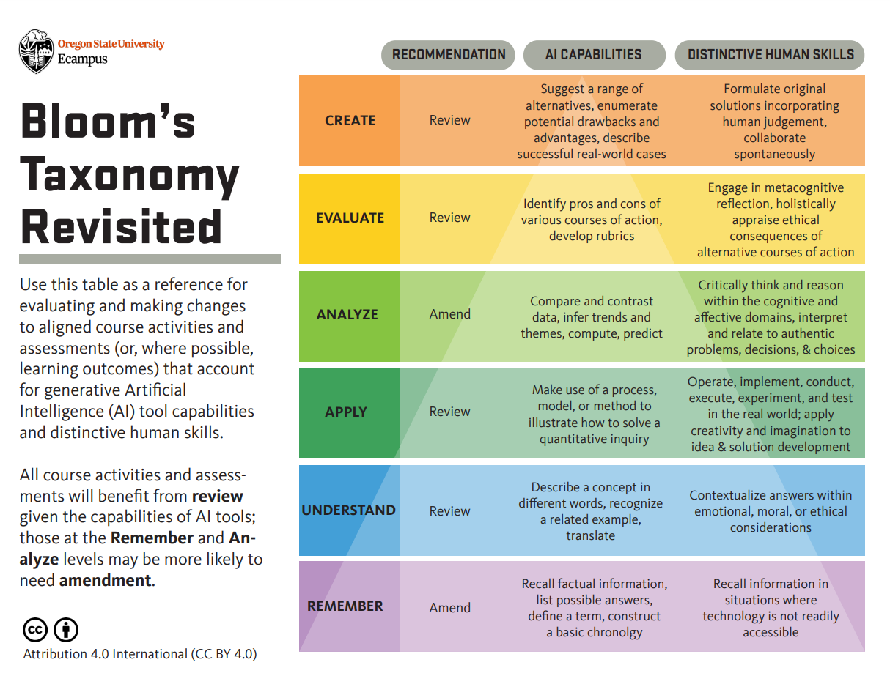

# AI Literacy and Disciplinary Thinking - Workshop Outline

## Workshop Information

**Title:** AI Literacy and Disciplinary Thinking  
**Date:** Monday, March 4, 2024  
**Time:** 3:00-4:30 PM  
**Duration:** 90 minutes  
**Format:** Hyflex (Zoom and in-person, Room 3317)  
**Facilitators:** Zach Muhlbauer and Manju Adikesevan

## Workshop Description

Instructors teaching with artificial intelligence face critical issues in data privacy, intellectual property, and algorithmic bias. This workshop helps participants learn how these concerns can inform the selection of AI tools suitable for their discipline and how to impart similar AI literacies to their students.

## Detailed Agenda

### Part 1: Group Brainstorm - Taking Inventory of AI Tools (20 minutes)

**Activity:** Prompt attendees to define what AI literacy entails for teaching in their specific discipline

**Process:**
- Discuss and draw connections between their disciplinary definitions of AI literacy
- Explore how AI tools have different affordances that can be customized to disciplinary contexts

**Discussion Prompts:**
- What AI platforms do you know of besides ChatGPT? (Poll Everywhere + Word Cloud)

-   How are they relevant to your discipline? (Group Discussion)

-   Where do you see the need for AI literacies when teaching your discipline? (Group Discussion)

**Part 2**

(40 minutes, 8 slides)

**Presentation (with Q&A interspersed): AI Literacy Framework**

**AI Literacy Framework**: Walk through AI literacy framework with attention to four sets of capabilities --- application, authenticity, accountability, and agency --- for attendees to adapt to assignments used to teach their discipline.

> **Prompts**:

1.  Select an assignment you have taught in the past and one AI tool to support a specific stage of that assignment

**Application** involves knowing how to use AI tools that are aligned with the task at hand

-   Helping students decide which AI tool to use for different tasks

-   Assessing the capabilities and limitations of that tool within their discipline

-   Establishing best practices for optimizing students' use of that tool (e.g. use of specific commands, prompts, or queries)

-   Scrutinizing the data set on which the tool is trained

> **Prompt**:

1.  How will students apply the AI tool to a specific stage of your assignment?

**Agency** involves students retaining control over their learning process

-   Assessing whether use of AI enables students to retain or expand personal choices

-   Ensuring students use AI intentionally to expand their knowledge and skills

-   Empowering students to make independent decisions while using AI for assistance

> **Prompt**: How can students use the AI tool to expand knowledge or skills relevant to your assignment?

**Authenticity** involves centering genuine human communication and interaction

-   Fostering intrinsic motivation among students to express their own voice or style

-   Engaging students in interest-driven learning that promotes authentic participation

-   Encouraging students to build trust and credibility as part of their use of AI tools

> **Prompt**: How can students express their own voice or style in their use of AI for your assignment?

**Accountability** involves taking responsibility for AI-influenced content and using generative AI in a fair and equitable manner within specific disciplines

-   Guiding students to factually verify and take responsibility for AI content

-   Ensuring AI tools used to support work provide equal access to all stakeholders

-   Teaching how to properly cite and attribute AI tools within specific disciplines

> **Prompt**: How can student expect to be held accountable for their use of AI in response to your assignment?

**[Part 3\
]{.underline}**(30 minutes, 2 slides, in a shared document)

**Work-on-your-own activity: Assignment Makeover**

-   Attendees will pick one assignment they are currently using in their course

-   Revise the assignment instructions/parameters to reflect AI literacies relevant to their discipline

-   Craft assignment instructions about instructors policies and expectations around the use of AI for the assignment

# \*\*\*\*\*\*\*\*\*\*\*\*\*\*\*\*\*\*\*\*\*\*\*\*\*\*\*\*\*\*\*\*\*\*\*\*\*\*\*\*\*\*\*\*\*\*\*\*\*\*\*\*\*\*\*\*\*\*\*\*\*\*\*\*\*

# **Workshop Planning and Outline (Feb 27)**

**Part 1**

**Group Brainstorm: Defining AI Literacy and Discussion** (20 minutes, 2 slides, in a shared document/board)

-   Prompt attendees to define what AI literacy entails for teaching in their specific discipline

-   Discuss and draw connections between their disciplinary definitions of AI literacy

-   AI tools have different affordances that can be customized to disciplinary contexts.

> Prompts:

-   What AI platforms do you know of besides ChatGPT (Poll Everywhere + Word Cloud)

-   How are they relevant to your discipline? (Group Discussion)

-   Where do you see the need for AI literacies when teaching your discipline? (Group Discussion)

**Part 2**

(40 minutes, 6-8 slides)

**Presentation (with Q&A interspersed): AI Literacy Framework**

**AI Literacy Framework**: Walk through AI literacy framework with attention to four sets of capabilities --- application, authenticity, accountability, and agency --- for attendees to adapt to their discipline.

-   **Application** involves knowing how to use AI tools that are aligned with the task at hand

    -   Helping students decide which AI tool to use for different tasks

    -   Assessing the capabilities and limitations of that tool within their discipline

    -   Establishing best practices for optimizing students' use of that tool

        -   e.g. use of commands, prompts, or queries

    -   Scrutinizing the data set on which the tool is trained

-   **Accountability** involves taking responsibility for AI-influenced content and using generative AI in a fair and equitable manner within specific disciplines

    -   Guiding students to factually verify and take responsibility for AI content

    -   Ensuring AI tools used to support work provide equal access to all stakeholders

    -   Teaching how to properly cite and attribute AI tools within specific disciplines

-   **Authenticity** involves centering genuine human communication and interaction

    -   Fostering intrinsic motivation among students to express their own voice or style

    -   Engaging students in interest-driven learning that promotes authentic participation

    -   Encouraging students to build trust and credibility as part of their use of AI tools

-   **Agency** involves students retaining control over their learning process

    -   Assessing whether use of AI enables students to retain or expand personal choices

    -   Ensuring students use AI intentionally to expand their knowledge and skills

    -   Empowering students to make independent decisions in using AI for assistance

**[Part 3\
]{.underline}**(30 minutes, 2 slides, in a shared document)

**Synthesis Activity and Discussion**. Prompt attendees to identify one learning outcome from Bloom's Taxonomy to implement AI literacies (authenticity, accountability, agency, application)

{width="6.5151432633420825in" height="5.034958442694663in"}

Anchor points and examples

**Literacy Narrative - a learning journey about any topic - fashion literacy, multicultural identity literacy**

**Example: Describe the learning assignment Literacy Narrative**

**Identify the cognitive level within Blooms Taxonomy: Create**

  ---------------------------------------------------------------------------------------------------------
                          **Human Skills**                                          **AI Capabilities**
  ----------------------- --------------------------------------------------------- -----------------------
  **Accountability**                                                                

  **Authenticity**        Derived from student positionality and lived experience   

  **Application**                                                                   

  **Agency**                                                                        
  ---------------------------------------------------------------------------------------------------------

  ----------------------------------------------------------------------------------------------------------------------------------------
  Learning Outcome   Accountability   Agency   Application   Authenticity                                                
  ------------------ ---------------- -------- ------------- ----------------------------------------------------------- -----------------
                                                             Human Skills                                                AI Capabilities

  Create                                                     The source of knowledge - positionality, lived experience   

  Evaluate                                                                                                               

  Analyze                                                                                                                

  Apply                                                                                                                  

  Understand                                                                                                             

  Remember                                                                                                               
  ----------------------------------------------------------------------------------------------------------------------------------------

Post-feedback notes

Blooms Taxonomy + AI Literacies - redo a graphic to intersect with the 4 As

Application, Accountability, and Agency
